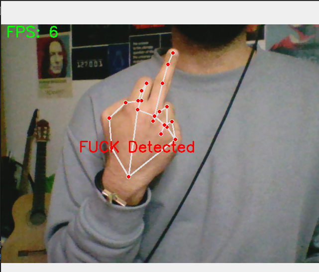

# Computer Vision

Computer Vision is a project that utilizes computer vision techniques to detect and interpret hand gestures for controlling various aspects of a system. This project includes four modules and one application that work together to provide hand gesture-based control.

## Modules

The following are the four modules included in this project:

### 1. FaceDetectionModule

The [FaceDetectionModule](modules%2FFaceDetectionModule.py) The FaceDetectionModule is responsible for detecting faces in a video stream or image. It utilizes the Mediapipe library to perform face detection using a pre-trained model. The module provides functions to detect face and retrieve the hand landmarks.

### 2. FaceMeshModule

The [FaceMeshModule](modules%2FFaceMeshModule.py) is used for recognizing specific face gestures based on the face landmarks detected by the FaceMeshDetector. It implements algorithms or machine learning models to classify the face gestures and provides functions to retrieve the recognized gestures.

### 3. HandTrackingModule

The [HandTrackingModule](modules%2FHandTrackingModule.py) tracks the movement of the hand in real-time by continuously detecting and tracking the hand landmarks. It can be used to estimate the hand's position, track gestures over time, or perform more advanced hand motion analysis.

### 4. PoseEstimationModule

The [PoseEstimationModule](modules%2FPoseEstimationModule.py) is responsible for estimating the pose or body posture of a person based on the detected landmarks. It uses the Mediapipe library to detect and track various body landmarks, allowing for applications such as body posture analysis or exercise tracking.

## HandVoumeControler App

The [HandVoumeControler](HandVoumeControler.py) application is an example application that showcases the use of the [HandTrackingModule](modules%2FHandTrackingModule.py) module to control the system's volume using hand gestures. It detects the hand, tracks the hand movement, recognizes specific gestures, and adjusts the system volume accordingly.

## FuckDetector App

The [FuckDetector](FuckDetector.py) application is annother example application that showcases the use of the [HandTrackingModule](modules%2FHandTrackingModule.py) module to detect fingers and alert if someone shows the camera a middle finger. It detects the hand, tracks the hand movement..

## Getting Started

To get started with this project, follow these steps:

1. Clone the repository to your local machine.

       git clone https://github.com/drunkleen/ComputerVision

2. Install the required dependencies by running

       pip install -r requirements.txt

3. Explore the documentation of [Mediapipe](https://mediapipe.dev/) and examples provided for each module (will be added soon).
4. Customize and extend the modules or develop your own application based on the modules provided.

## Dependencies

The project relies on the following dependencies:

- OpenCV: for capturing and processing video frames.
- Mediapipe: for hand and pose detection, tracking, and landmark estimation.
- NumPy: for numerical computations and array manipulation.
- pycaw: for controlling the system volume on Windows.

Refer to the individual module files for more specific dependencies and installation instructions if needed.

## License

This project is licensed under the MIT License. See the [LICENSE](LICENSE) file for more details.

## Contributing

Contributions to this project are welcome. Feel free to open issues or submit pull requests to suggest improvements, report bugs, or add new features.

## Acknowledgments

This project makes use of the following open-source libraries and resources:

- [OpenCV](https://opencv.org/)
- [Mediapipe](https://mediapipe.dev/)
- [pycaw](https://github.com/AndreMiras/pycaw)

I express my gratitude to the developers and contributors of these libraries for their valuable work.

